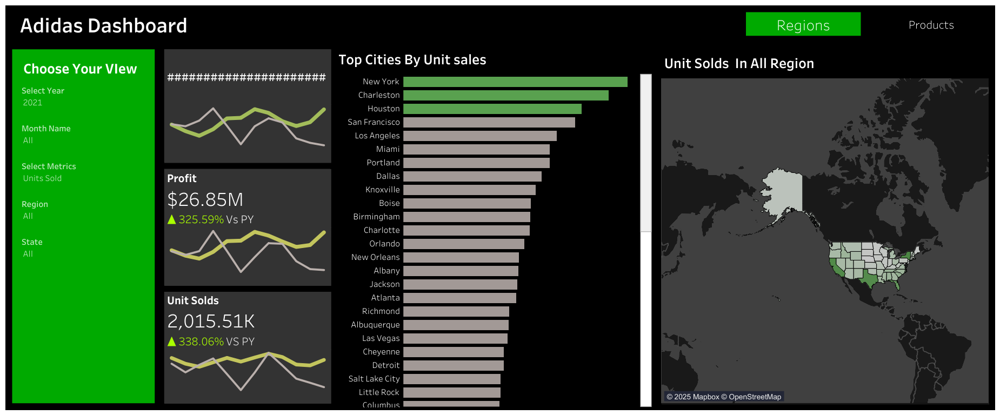
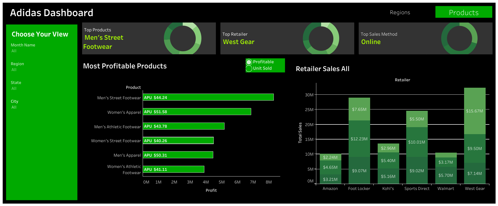

# adidas-sales-dashboard-tableau
This repository contains a two-page interactive sales dashboard built in Tableau using an Adidas sales dataset. The dashboard is designed to analyze performance across regions, cities, products, retailers, and payment methods.

---

## 🧾 Dataset Overview

The dataset includes transaction-level Adidas sales data with the following key fields:
- Invoice Date
- Region, State, City
- Product Category
- Retailer & Retailer ID
- Payment Method
- Units Sold, Total Sales, Operating Profit

---

## 🎯 Objectives

- Analyze regional performance by sales, profit, and units sold
- Identify top-performing cities, products, retailers, and payment channels
- Enable dynamic comparisons using KPIs and interactive visuals
- Facilitate actionable business insights through intuitive UX

---

## 📈 Dashboard Structure

### 🟦 Page 1: Regional Performance Overview

- **KPIs**:
  - Total Sales (Current vs Previous Year)
  - Operating Profit (Current vs Previous Year)
  - Units Sold (Current vs Previous Year)
  - Percentage change shown with green/red arrow indicators

- **Visuals**:
  - Bar Chart: Top 20 cities (Total Sales, Profit, Units Sold) based on metric selection via parameter
  - Map View: Regional sales distribution with metric selection
  - All visuals dynamically respond to Region/State filters

---

### 🟨 Page 2: Product & Channel Insights

- **KPI Cards + Donut Charts**:
  - Top-Selling Product (Green slice in donut)
  - Top Retailer
  - Most Used Sales Method

- **Visuals**:
  - Bar Chart: Top Products by Total Sales or Profit (controlled by parameter)
  - Stacked Bar Chart: Retailer vs Total Sales, colored by Sales Method

- KPIs and donut charts are dynamic and update based on filters (Region, Date, etc.)

---

## 🛠️ Tools Used

- **Tableau** (Desktop/Public)
- Data cleaning in Excel/SQL (optional)
- Parameter controls, Table Calculations, LOD expressions

---

## 📌 Features

- Responsive to filters (Region, State, Month)
- Parameter-controlled visuals (metric selection)
- Dynamic coloring (top performer highlights in green, others grey)
- Clean, minimal layout inspired by Adidas branding

---

## 📷 Screenshots

### 📌 Regional Performance Page

### 📌 Product & Channel Insights Page

---

## 🌐 Live Dashboard

View the interactive Tableau dashboard here:  
👉 [Click to Open on Tableau Public](https://public.tableau.com/shared/PMG6MF585?:display_count=n&:origin=viz_share_link)

## 🚀 How to Use

1. Open the link  in Tableau Public
2. Use the **Select Metric** parameter to switch views on bar and map charts
3. Use **Region/State filters** to focus analysis
4. Hover over charts for interactive tooltips and insights

---
